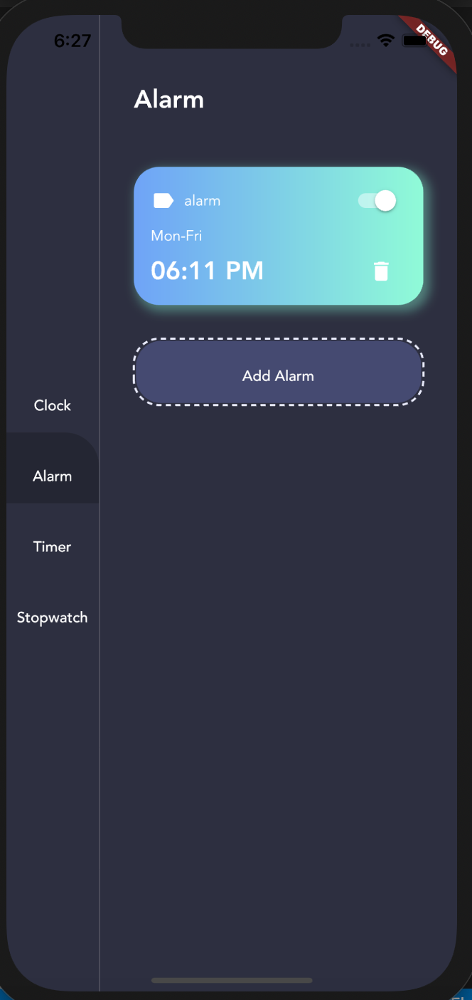
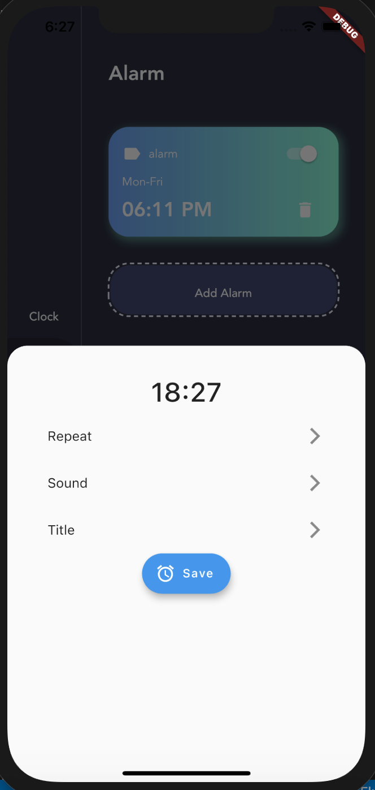

# Post-It
Productivity App for capturing your daily goals. Allows you to set reminders and access the date/time calendar. It uses a SQLite database for storing data. Built in Flutter with a Python backend

    
    

    
    

